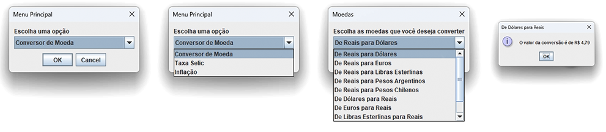

# Conversor de moeda Challenge ONE Back End

Nesta oportunidade foi solicitado para nós Devs a criação de um conversor de moeda utilizando a linguagem Java. As características solicitadas por nosso cliente são as seguintes:

**O conversor de moeda deverá:**

  - Converter de Reais a Dólar
  - Converter de Reais a Euro
  - Converter de Reais a Libras Esterlinas
  - Converter de Reais a Peso argentino
  - Converter de Reais a Peso Chileno
     
**Lembrando que deve ser possível também converter de forma inversa ou seja:**

  - Converter de Dólar a Reais
  - Converter de Euro a Reais
  - Converter de Libras Esterlinas a Reais
  - Converter de Peso argentino a  Reais
  - Converter de Peso Chileno a Reais
       
Como desafio extra incentivamos vocês a deixar fluir sua criatividade, se posso converter moedas, será que posso tal vez adicionar a meu programa outro tipo de conversões como temperatura por exemplo?

É hora de surpreender nosso cliente com uma feature que tal vez nem ele sabia que precisava.

## Como desafio extra foram adicionados
  - Taxa SELIC
  - Inflação

## Todos os Dados são atualizados em tempo real, por uma API
- Caso não seja possível obter os dados atualizados da API será mostrado dados salvos anteriormente

https://github.com/jmsmarcelo/currency-converter/assets/32857346/85396ceb-b898-406f-9046-9bb8d60465bb

